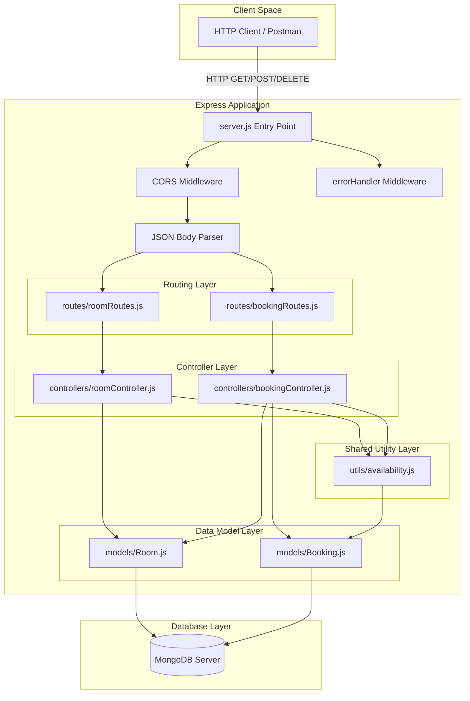

# Architecture

## Purpose
This document details the architectural design and structural patterns used in the **BookInn** backend application.

---

## What is Currently Implemented

The application follows a **Layered Modular Architecture** (Controller-Service/Utility-Model pattern) built on Node.js and Express.js.

### Key Architectural Layers:
1. **Entry Point Layer (`server.js`)**: Configures environment, middleware stack, mounts routers, connects to MongoDB, and binds the HTTP port.
2. **Configuration Layer (`config/db.js`)**: Encapsulates database connection setup using Mongoose.
3. **Routing Layer (`routes/`)**: Maps incoming REST HTTP methods and paths strictly to controller functions with zero embedded logic.
4. **Controller Layer (`controllers/`)**: Manages HTTP request parsing, status codes, response formatting, and calls models or utility functions.
5. **Utility Layer (`utils/availability.js`)**: Contains domain business logic (specifically date overlap algorithms) shared across multiple controllers.
6. **Data Layer (`models/`)**: Defines Mongoose database schemas, validation hooks, and handles direct interactions with MongoDB collections.
7. **Middleware Layer (`middleware/errorHandler.js`)**: Provides centralized error processing for uncaught exceptions passed via `next()`.

---

## Architecture Diagram

---

## How It Works

### Separation of Concerns
- **Routes** (`roomRoutes.js`, `bookingRoutes.js`) contain **no business logic**. They act purely as mapping tables binding URL patterns (`/`, `/available`, `/:id`) and HTTP verbs (`GET`, `POST`, `DELETE`) to controller functions.
- **Controllers** (`roomController.js`, `bookingController.js`) handle request parsing (`req.params`, `req.query`, `req.body`), trigger business/data checks, and return HTTP status codes (`200`, `201`, `400`, `404`, `409`, `500`).
- **Shared Business Logic** (`utils/availability.js`) decouples the overlap calculation logic from HTTP requests. Both room search (`getAvailableRooms`) and booking creation (`createBooking`) call `getBookedRoomIds(checkIn, checkOut)` to guarantee a single source of truth.
- **Database Initialization** (`config/db.js`) is isolated from application routing. If MongoDB connection fails during startup, the process terminates cleanly (`process.exit(1)`).

---

## Important Files Involved
- [server.js](file:///c:/Users/kadiw/OneDrive/Desktop/BookInn/server.js) — Entry point bootstrap.
- [config/db.js](file:///c:/Users/kadiw/OneDrive/Desktop/BookInn/config/db.js) — Database lifecycle.
- [utils/availability.js](file:///c:/Users/kadiw/OneDrive/Desktop/BookInn/utils/availability.js) — Domain business rule helper.
- [controllers/roomController.js](file:///c:/Users/kadiw/OneDrive/Desktop/BookInn/controllers/roomController.js) — Controller for room actions.
- [controllers/bookingController.js](file:///c:/Users/kadiw/OneDrive/Desktop/BookInn/controllers/bookingController.js) — Controller for booking actions.

---

## Dependencies
- Node.js runtime environment.
- Express web application framework.
- Mongoose ODM layer connecting to MongoDB.
