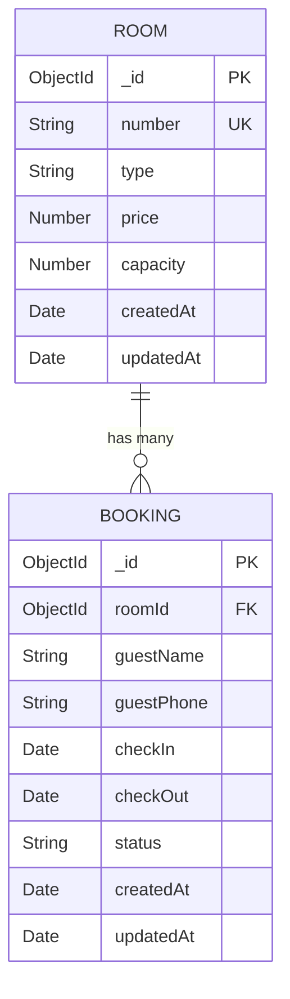

# Backend — Models

## Purpose
This document details the Mongoose schemas and data models defining the database collection structures in **BookInn**.

---

## What is Currently Implemented

The application implements two data models:
1. `Room` (`models/Room.js`)
2. `Booking` (`models/Booking.js`)

---

## 1. Room Model (`models/Room.js`)

```javascript
const mongoose = require("mongoose");

const roomSchema = new mongoose.Schema(
  {
    number: {
      type: String,
      required: true,
      unique: true,
    },
    type: {
      type: String,
      required: true,
    },
    price: {
      type: Number,
      required: true,
    },
    capacity: {
      type: Number,
      required: true,
    },
  },
  { timestamps: true }
);

module.exports = mongoose.model("Room", roomSchema);
```

### Fields & Constraints:
- `number`: `String`, required, unique index enforced (`unique: true`).
- `type`: `String`, required (e.g., `"Deluxe"`, `"Single"`).
- `price`: `Number`, required (static price per night).
- `capacity`: `Number`, required (max guests).
- `timestamps`: Automatically adds `createdAt` and `updatedAt` Date fields.

---

## 2. Booking Model (`models/Booking.js`)

```javascript
const mongoose = require("mongoose");

const bookingSchema = new mongoose.Schema(
  {
    roomId: {
      type: mongoose.Schema.Types.ObjectId,
      ref: "Room",
      required: true,
    },
    guestName: {
      type: String,
      required: true,
    },
    guestPhone: {
      type: String,
      required: true,
    },
    checkIn: {
      type: Date,
      required: true,
    },
    checkOut: {
      type: Date,
      required: true,
      validate: {
        validator: function (value) {
          return value > this.checkIn;
        },
        message: "checkOut must be after checkIn",
      },
    },
    status: {
      type: String,
      default: "confirmed",
    },
  },
  { timestamps: true }
);

module.exports = mongoose.model("Booking", bookingSchema);
```

### Fields & Constraints:
- `roomId`: `Schema.Types.ObjectId`, required, references `Room` model (`ref: "Room"`).
- `guestName`: `String`, required.
- `guestPhone`: `String`, required.
- `checkIn`: `Date`, required.
- `checkOut`: `Date`, required, custom schema validator checking `value > this.checkIn` (returns message `"checkOut must be after checkIn"`).
- `status`: `String`, default value `"confirmed"`.
- `timestamps`: Automatically adds `createdAt` and `updatedAt` Date fields.

---

## Model Relationships



---

## Important Files Involved
- [models/Room.js](file:///c:/Users/kadiw/OneDrive/Desktop/BookInn/models/Room.js)
- [models/Booking.js](file:///c:/Users/kadiw/OneDrive/Desktop/BookInn/models/Booking.js)

---

## Dependencies
- `mongoose`
