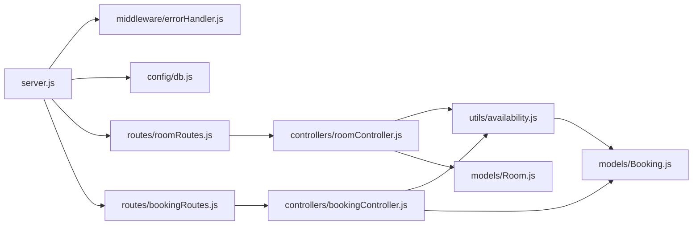

# Backend Overview

## Purpose
This document presents an overview of the server-side application architecture for **BookInn**.

---

## What is Currently Implemented

The backend is built as a RESTful web service using Node.js, Express.js, and Mongoose ODM.

### Key Implemented Components:
1. **Server Initialization (`server.js`)**: Configures Express middleware, database connection promise handling, and HTTP listener.
2. **Database Connector (`config/db.js`)**: Encapsulates `mongoose.connect()`.
3. **Route Handling (`routes/`)**: Exposes REST endpoints mounted under `/api/rooms` and `/api/bookings`.
4. **Controllers (`controllers/`)**: Executes request logic, input validation, calls database operations, and returns structured JSON responses.
5. **Shared Utilities (`utils/availability.js`)**: Implements reusable room date-range availability algorithms.
6. **Error Handler (`middleware/errorHandler.js`)**: Global middleware catching unhandled errors and formatting JSON error output.
7. **Database Schemas (`models/`)**: Mongoose definitions for `Room` and `Booking`.

---

## Component Architecture

---

## How It Works
- Requests arrive at [[Backend/Server|server.js]].
- Request payload is parsed by `express.json()` and headers handled by `cors()`.
- Requests matching `/api/rooms/*` are routed to [[Backend/API Routes|roomRoutes.js]].
- Requests matching `/api/bookings/*` are routed to [[Backend/API Routes|bookingRoutes.js]].
- Controller actions invoke queries on Mongoose models or compute date overlap via [[Backend/Utilities|availability.js]].
- JSON responses are dispatched back to the caller with status codes `200`, `201`, `400`, `404`, `409`, or `500`.

---

## Important Files Involved
- [server.js](file:///c:/Users/kadiw/OneDrive/Desktop/BookInn/server.js)
- [config/db.js](file:///c:/Users/kadiw/OneDrive/Desktop/BookInn/config/db.js)
- [middleware/errorHandler.js](file:///c:/Users/kadiw/OneDrive/Desktop/BookInn/middleware/errorHandler.js)
- [routes/roomRoutes.js](file:///c:/Users/kadiw/OneDrive/Desktop/BookInn/routes/roomRoutes.js)
- [routes/bookingRoutes.js](file:///c:/Users/kadiw/OneDrive/Desktop/BookInn/routes/bookingRoutes.js)
- [controllers/roomController.js](file:///c:/Users/kadiw/OneDrive/Desktop/BookInn/controllers/roomController.js)
- [controllers/bookingController.js](file:///c:/Users/kadiw/OneDrive/Desktop/BookInn/controllers/bookingController.js)
- [utils/availability.js](file:///c:/Users/kadiw/OneDrive/Desktop/BookInn/utils/availability.js)
- [models/Room.js](file:///c:/Users/kadiw/OneDrive/Desktop/BookInn/models/Room.js)
- [models/Booking.js](file:///c:/Users/kadiw/OneDrive/Desktop/BookInn/models/Booking.js)

---

## Dependencies
- `express`
- `mongoose`
- `cors`
- `dotenv`
