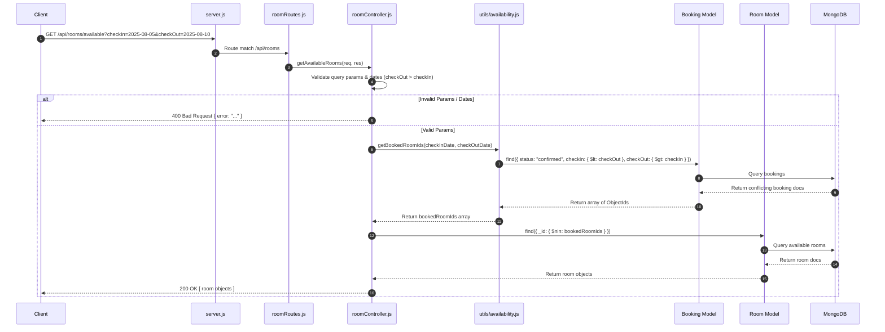
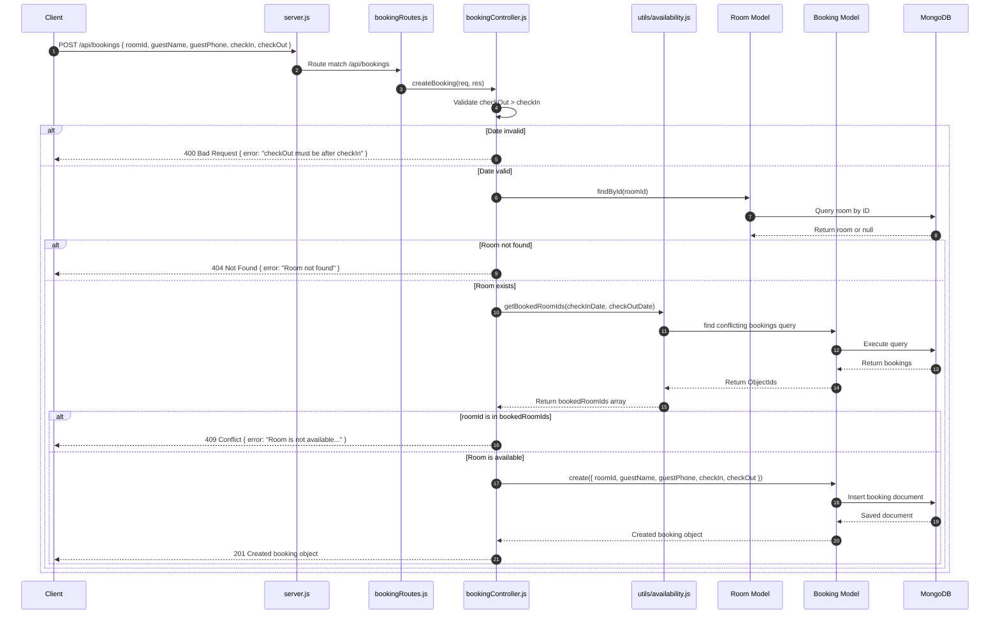
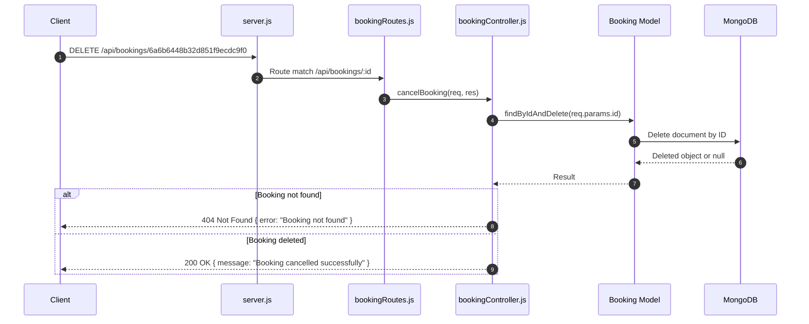

# Backend — Request Flow

## Purpose
This document provides end-to-end request lifecycle sequence diagrams for all primary operations in **BookInn**.

---

## What is Currently Implemented

The diagrams below represent the actual execution pathways of HTTP requests through Express routers, controllers, shared utilities, and MongoDB ODM queries.

---

## 1. Get Available Rooms Flow (`GET /api/rooms/available`)

---

## 2. Create Booking Flow (`POST /api/bookings`)

---

## 3. Cancel Booking Flow (`DELETE /api/bookings/:id`)

---

## Important Files Involved
- [server.js](file:///c:/Users/kadiw/OneDrive/Desktop/BookInn/server.js)
- [routes/roomRoutes.js](file:///c:/Users/kadiw/OneDrive/Desktop/BookInn/routes/roomRoutes.js)
- [routes/bookingRoutes.js](file:///c:/Users/kadiw/OneDrive/Desktop/BookInn/routes/bookingRoutes.js)
- [controllers/roomController.js](file:///c:/Users/kadiw/OneDrive/Desktop/BookInn/controllers/roomController.js)
- [controllers/bookingController.js](file:///c:/Users/kadiw/OneDrive/Desktop/BookInn/controllers/bookingController.js)
- [utils/availability.js](file:///c:/Users/kadiw/OneDrive/Desktop/BookInn/utils/availability.js)
