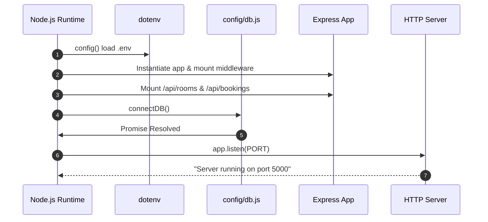

# Backend — Server Initialization

## Purpose
This document details `server.js`, the main application bootstrapping script for **BookInn**.

---

## What is Currently Implemented

`server.js` initializes environment configuration, Express app instance, middleware chain, API route mounting, database connection trigger, and starts the HTTP server.

### Complete File Implementation:

```javascript
require("dotenv").config();
const express = require("express");
const cors = require("cors");
const connectDB = require("./config/db");
const roomRoutes = require("./routes/roomRoutes");
const bookingRoutes = require("./routes/bookingRoutes");
const errorHandler = require("./middleware/errorHandler");

const app = express();
app.use(cors());
app.use(express.json());

app.use("/api/rooms", roomRoutes);
app.use("/api/bookings", bookingRoutes);
app.use(errorHandler);

connectDB().then(() => {
  app.listen(process.env.PORT || 5000, () =>
    console.log(`Server running on port ${process.env.PORT || 5000}`)
  );
});
```

---

## How It Works
1. `require("dotenv").config()` loads environment variables from `.env`.
2. `express()` instantiates the web application.
3. `app.use(cors())` enables cross-origin HTTP access.
4. `app.use(express.json())` parses incoming `application/json` HTTP body payloads.
5. `app.use("/api/rooms", roomRoutes)` mounts room routes.
6. `app.use("/api/bookings", bookingRoutes)` mounts booking routes.
7. `app.use(errorHandler)` registers the 4-argument custom error middleware.
8. `connectDB()` executes asynchronous MongoDB connection. Upon resolution (`.then()`), `app.listen()` binds the HTTP port (default `5000`).

---

## Data Flow & Lifecycle


---

## Important Files Involved
- [server.js](file:///c:/Users/kadiw/OneDrive/Desktop/BookInn/server.js) — Entry point file.
- [config/db.js](file:///c:/Users/kadiw/OneDrive/Desktop/BookInn/config/db.js) — Database connection helper.
- [routes/roomRoutes.js](file:///c:/Users/kadiw/OneDrive/Desktop/BookInn/routes/roomRoutes.js) — Room endpoints router.
- [routes/bookingRoutes.js](file:///c:/Users/kadiw/OneDrive/Desktop/BookInn/routes/bookingRoutes.js) — Booking endpoints router.
- [middleware/errorHandler.js](file:///c:/Users/kadiw/OneDrive/Desktop/BookInn/middleware/errorHandler.js) — Error handling middleware.

---

## Dependencies
- `express`
- `cors`
- `dotenv`
- `./config/db`
