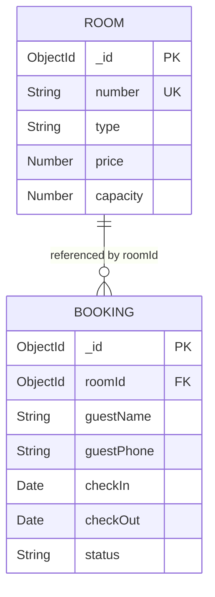

# Database — Relationships

## Purpose
This document explains entity relationships and cross-collection references in **BookInn**.

---

## What is Currently Implemented

The application uses **Normalized Document Referencing** between `Booking` and `Room` collections.

---

## Relationship Structure

- **`Booking` → `Room`**: **Many-to-One** relationship.
  - Multiple `Booking` documents can reference a single `Room` document via `Booking.roomId`.
  - Defined in `models/Booking.js` using Mongoose ref syntax:
    ```javascript
    roomId: {
      type: mongoose.Schema.Types.ObjectId,
      ref: "Room",
      required: true
    }
    ```

---

## Mongoose Population (`.populate()`)

In `controllers/bookingController.js`, `getAllBookings` populates the referenced `Room` object into the returned JSON:

```javascript
const bookings = await Booking.find().populate("roomId");
```

### Resulting Object Structure:
Instead of returning just the `ObjectId` string, Mongoose resolves the reference into the embedded `Room` document:

```json
{
  "_id": "6a6b6448b32d851f9ecdc9f0",
  "roomId": {
    "_id": "6a6b54e74de56a2fb9ad10a9",
    "number": "101",
    "type": "Deluxe",
    "price": 3000,
    "capacity": 2,
    "createdAt": "2026-07-30T13:43:03.933Z",
    "updatedAt": "2026-07-30T13:43:03.933Z"
  },
  "guestName": "Alice",
  "guestPhone": "9876543210",
  "checkIn": "2025-08-05T00:00:00.000Z",
  "checkOut": "2025-08-10T00:00:00.000Z",
  "status": "confirmed",
  "createdAt": "2026-07-30T14:48:40.215Z",
  "updatedAt": "2026-07-30T14:48:40.215Z"
}
```

---

## Entity Relationship Diagram



---

## Important Files Involved
- [models/Booking.js](file:///c:/Users/kadiw/OneDrive/Desktop/BookInn/models/Booking.js)
- [models/Room.js](file:///c:/Users/kadiw/OneDrive/Desktop/BookInn/models/Room.js)
- [controllers/bookingController.js](file:///c:/Users/kadiw/OneDrive/Desktop/BookInn/controllers/bookingController.js)
