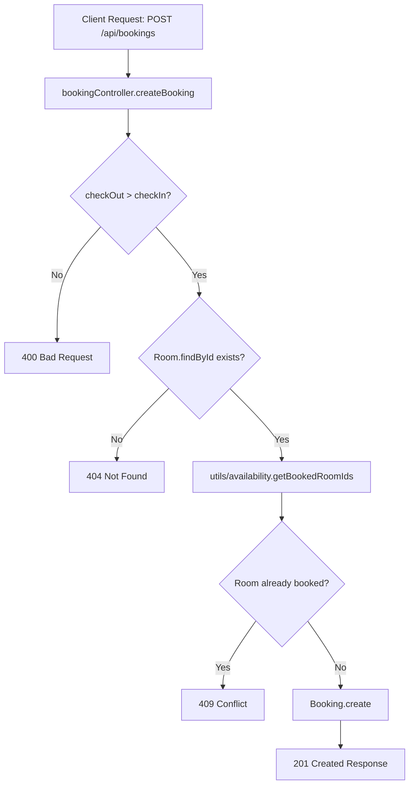

# Features — Bookings

## Purpose
This document explains the functionality of the **Bookings** feature in **BookInn**.

---

## What is Currently Implemented

The Bookings feature manages customer stay reservations, prevents double-booking, and handles booking cancellations.

### Sub-features & Capabilities:
1. **Fetch All Bookings**: Retrieves all bookings with populated room details (`GET /api/bookings`).
2. **Create Booking**: Validates input dates, checks room existence, verifies availability, and saves booking (`POST /api/bookings`).
3. **Cancel Booking**: Deletes a booking document by ID (`DELETE /api/bookings/:id`).

---

## How It Works

### Booking Creation Logic (`POST /api/bookings`)
1. Accepts `roomId`, `guestName`, `guestPhone`, `checkIn`, `checkOut` in `req.body`.
2. Validates `checkOut > checkIn` (`400 Bad Request` if invalid).
3. Verifies `Room.findById(roomId)` exists (`404 Not Found` if missing).
4. Invokes `getBookedRoomIds(checkInDate, checkOutDate)` from [[Backend/Utilities|availability.js]].
5. Checks if `roomId` is present in `bookedRoomIds`. If present, returns `409 Conflict` (`"Room is not available for the selected dates"`).
6. Creates new document via `Booking.create(...)` with default `status: "confirmed"`.
7. Returns `201 Created` with created booking object.

### Booking Cancellation (`DELETE /api/bookings/:id`)
1. Executes `Booking.findByIdAndDelete(req.params.id)`.
2. If document is null, returns `404 Not Found`.
3. If document exists, returns `200 OK` with `{ "message": "Booking cancelled successfully" }`.

---

## Data Flow Diagram

---

## Important Files Involved
- [models/Booking.js](file:///c:/Users/kadiw/OneDrive/Desktop/BookInn/models/Booking.js)
- [routes/bookingRoutes.js](file:///c:/Users/kadiw/OneDrive/Desktop/BookInn/routes/bookingRoutes.js)
- [controllers/bookingController.js](file:///c:/Users/kadiw/OneDrive/Desktop/BookInn/controllers/bookingController.js)
- [utils/availability.js](file:///c:/Users/kadiw/OneDrive/Desktop/BookInn/utils/availability.js)

---

## Dependencies
- Express.js Router
- Mongoose ODM
