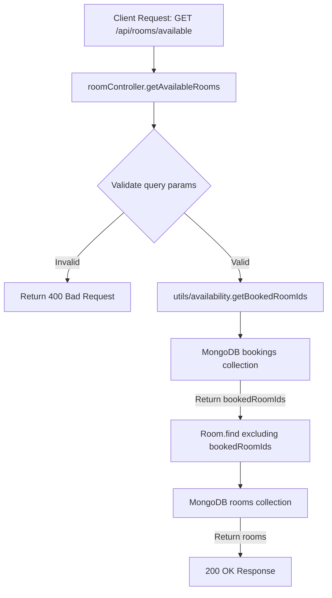

# Features — Rooms

## Purpose
This document explains the functionality of the **Rooms** feature in **BookInn**.

---

## What is Currently Implemented

The Rooms feature handles room listing and date-filtered availability searches.

### Sub-features & Capabilities:
1. **Fetch All Rooms**: Returns array of all room documents (`GET /api/rooms`).
2. **Filter Available Rooms by Date Range**: Returns available rooms that have no overlapping confirmed bookings for a given `checkIn` and `checkOut` range (`GET /api/rooms/available`).

---

## How It Works

### Availability Calculation (`GET /api/rooms/available`)
1. Client provides `checkIn` and `checkOut` query parameters.
2. Controller converts inputs to `Date` objects and verifies `checkOut > checkIn`.
3. Invokes `getBookedRoomIds(checkInDate, checkOutDate)` from [[Backend/Utilities|availability.js]].
4. Utility executes a MongoDB query against the `bookings` collection:
   ```javascript
   Booking.find({
     status: "confirmed",
     checkIn: { $lt: checkOut },
     checkOut: { $gt: checkIn }
   }).select("roomId");
   ```
5. Returns array of occupied room IDs (`bookedRoomIds`).
6. Controller executes query against `rooms` collection:
   ```javascript
   Room.find({ _id: { $nin: bookedRoomIds } });
   ```
7. Returns available room array to client.

---

## Data Flow Diagram



---

## Important Files Involved
- [models/Room.js](file:///c:/Users/kadiw/OneDrive/Desktop/BookInn/models/Room.js)
- [routes/roomRoutes.js](file:///c:/Users/kadiw/OneDrive/Desktop/BookInn/routes/roomRoutes.js)
- [controllers/roomController.js](file:///c:/Users/kadiw/OneDrive/Desktop/BookInn/controllers/roomController.js)
- [utils/availability.js](file:///c:/Users/kadiw/OneDrive/Desktop/BookInn/utils/availability.js)

---

## Dependencies
- Express.js Router
- Mongoose ODM
