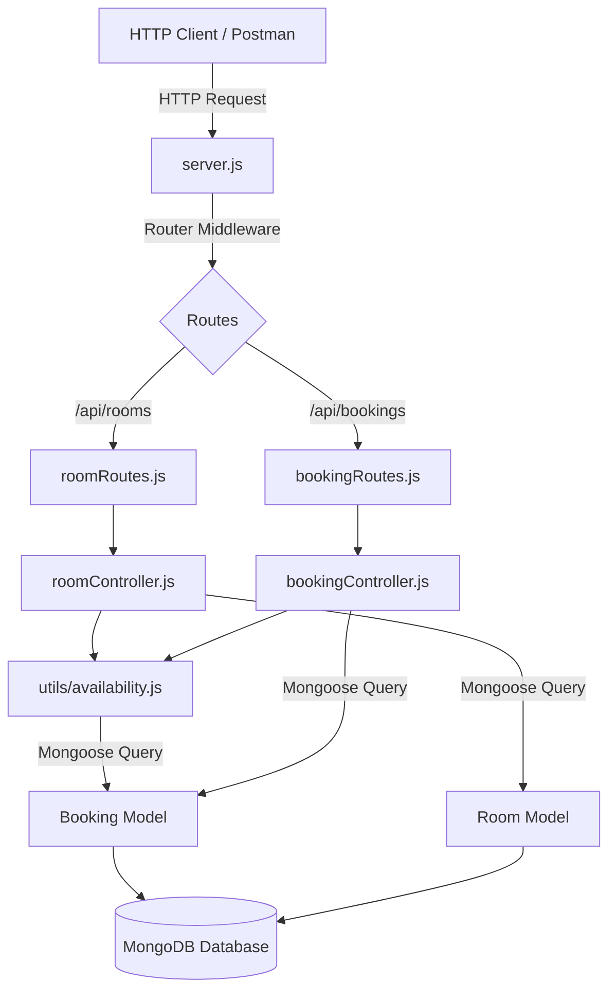

# Project Overview

## Purpose
The purpose of the **BookInn** project is to serve as a lightweight, modular REST API for a Hotel Management System. It currently handles room inventory management, room availability searches, booking creation with date conflict detection, and booking cancellation.

---

## What is Currently Implemented
The backend API is implemented using Node.js, Express.js, and MongoDB (via Mongoose). 

### Implemented Entities & Features:
1. **Rooms**:
   - Fetching all rooms (`GET /api/rooms`).
   - Fetching available rooms filtered by date range (`GET /api/rooms/available`).
2. **Bookings**:
   - Fetching all bookings populated with room data (`GET /api/bookings`).
   - Creating new bookings with strict date overlap validation (`POST /api/bookings`).
   - Cancelling/deleting bookings by ID (`DELETE /api/bookings/:id`).
3. **Core Utility Logic**:
   - Centralized date overlap algorithm in [[Backend/Utilities|availability.js]] ensuring same-day turnover (checkout morning, checkin afternoon) is permitted.

### Scope Boundaries (What is NOT Implemented):
- No frontend client exists in the repository.
- No separate Guest or Customer model (guest info is inline within `Booking`).
- No Dining, Food, Staff, or Administrative Dashboard modules.
- No Authentication or Authorization middleware.
- No dynamic room pricing (pricing is static per room).

---

## How It Works
1. Client sends HTTP requests to Express server running on port `5000` (or `process.env.PORT`).
2. [[Backend/Server|server.js]] handles request parsing (CORS & JSON body parser) and forwards requests to modular route handlers.
3. Routes in [[Backend/API Routes|roomRoutes.js]] and [[Backend/API Routes|bookingRoutes.js]] delegate execution to controllers in [[Backend/Controllers|roomController.js]] and [[Backend/Controllers|bookingController.js]].
4. Controllers call Mongoose models ([[Backend/Models|Room.js]] and [[Backend/Models|Booking.js]]) and the shared helper [[Backend/Utilities|availability.js]] to query MongoDB.
5. Errors are passed via `next(error)` or handled directly in controller try-catch blocks returning standardized JSON `{ "error": "message" }`.

---

## Important Files Involved
- [server.js](file:///c:/Users/kadiw/OneDrive/Desktop/BookInn/server.js) — Application setup and server listener.
- [config/db.js](file:///c:/Users/kadiw/OneDrive/Desktop/BookInn/config/db.js) — Database connection module.
- [models/Room.js](file:///c:/Users/kadiw/OneDrive/Desktop/BookInn/models/Room.js) — Room collection schema definition.
- [models/Booking.js](file:///c:/Users/kadiw/OneDrive/Desktop/BookInn/models/Booking.js) — Booking collection schema definition.
- [utils/availability.js](file:///c:/Users/kadiw/OneDrive/Desktop/BookInn/utils/availability.js) — Shared date range overlap query engine.
- [controllers/roomController.js](file:///c:/Users/kadiw/OneDrive/Desktop/BookInn/controllers/roomController.js) — Room route controllers.
- [controllers/bookingController.js](file:///c:/Users/kadiw/OneDrive/Desktop/BookInn/controllers/bookingController.js) — Booking route controllers.

---

## Data Flow

---

## Dependencies
As defined in `package.json`:
- `express` (`^4.21.0`) — Web framework.
- `mongoose` (`^8.24.2`) — MongoDB Object Data Modeling (ODM).
- `cors` (`^2.8.6`) — Cross-Origin Resource Sharing middleware.
- `dotenv` (`^16.4.5`) — Environment variable loader.
- `nodemon` (`^3.1.4`) — Dev auto-restart utility.

---

## Notes
- Database name is `bookinn` configured via `MONGO_URI` in `.env`.
- Project follows clean modular separation: routes map endpoints, controllers handle HTTP logic, utilities handle business rules, and models define database constraints.
